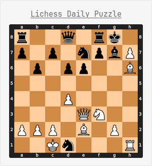

# lichess-glance
Lichess daily puzzle widget for glance



The [Lichess API](https://lichess.org/api#tag/bot) provides the daily puzzle in pgn, and this is a small flask server which draws the board, converts it to a PNG and serves it. The [glance](https://github.com/glanceapp/glance) widget fetches it. 

There's a similar excellent [widget](https://github.com/glanceapp/community-widgets/blob/main/widgets/chess-puzzle/README.md) for Chess.com. 

## Setup
The docker setup is inconvenient, at least as far as glance widgets go, but it's a good workaround for the API not serving the puzzle directly. So clone this repo: 


```bash
git clone https://github.com/yourusername/lichess-puzzle-widget.git
cd lichess-puzzle-widget
docker compose build
docker compose up -d
```

And also include the widget itself in glance. This depends on your setup. To keep it neat, I have a standalone file lichess.yml with the following content: 
```yaml
- type: custom-api
  title: Lichess Daily Puzzle
  cache: 6h
  url: URL:5000/daily_puzzle.json
  template: |
    <div style="text-align:center;">
      <h3 style="font-size:1.5rem; margin:0 0 8px 0;">
        <a href="{{ .JSON.String "link" }}" target="_blank" style="text-decoration:underline;">
          {{ .JSON.String "title" }}
        </a>
      </h3>
      
    </div>
```
and include it in my home.yml: 
```
- $include: widgets/lichess.yml
```
Of course you can also just put it directly into the home.yml
